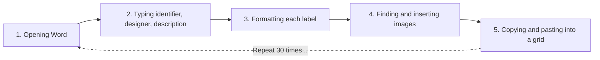

# From Spreadsheet to Ad-Hoc-Doc 1.0

INFO664: Programming for Cultural Heritage  
Pratt Institute, Fall 2025  
Created by Kelsey Kiantoro

## Background: Fashion Archives Need Different Solutions
Fashion archives face unique challenges. Unlike books that display titles on spines, garments hang in protective bags where identification relies entirely on external tags. This project addresses that specific need by automating the creation of physical bag tags that connect digital records to physical objects. Opening each bag to identify contents risks damage to fragile textiles and is incredibly time-consuming. External bag tags allow staff to browse collections visually, just like book spines on a shelf.

*Image credit: Victoria and Albert Museum. From: 5 expert tips on how to store clothes. [vogue.com.au](https://www.vogue.com.au/fashion/news/5-expert-tips-on-how-to-store-clothes/image-gallery/f3009b1b0da6c9bc2ee15f09eb75c0c8?pos=1&page=2)*

**About the photos:** These tags don't need museum-quality photography. A quick phone photo that shows color, silhouette, and key details is perfect. The goal is identification, not publication. If staff can look at the image and confirm "yes, this is the purple beaded dress," the tag works. Catalogs—daily operations need practical solutions.

The traditional method of creating these tags—typing each row individually in Word—is painfully slow. For 30 garments, this means:

This tutorial automates that entire process. What took 3-4 hours now takes 5 minutes.
## Label Generator Overview
This workflow creates physical bag tag labels for hanging garments in fashion archives. Our implementation uses the python-docx library, following the official documentation at https://python-docx.readthedocs.io/en/latest/. We specifically utilize three core components:
- [table creation](https://python-docx.readthedocs.io/en/latest/user/tables.html) for the 2x2 label grid in common letter size paper
- [text formatting](https://python-docx.readthedocs.io/en/latest/user/text.html) for proper hierarchy and emphasis 
- [document structure](https://python-docx.readthedocs.io/en/latest/user/documents.html) for page management

We chose the python-docx library because it is easy to use and has clear instructions. This makes it simple for archivists with little programming experience. By following the official tutorials, we keep our code easy to update and change for different collections.

### Working with Different Dataset Sizes
Before running the label generator, think about how many items you have and plan accordingly:
- For <ins>small collections</ins> (fewer than four items): You will see empty spaces on the label sheet. This is normal. You can wait and batch more items together.
- For <ins>medium collections</ins> (about 27 items, as in our example): Use the standard 2x2 layout. This will create multiple pages automatically. We recommended having an even number; the sample is within an odd number for example purposes.
- For <ins>large collections</ins> (100 or more items): Process your data in batches of 100 items. Each batch is written to its own output file for printing. This helps avoid memory issues.

This code automatically figures out how many pages are needed and handles cases where the last page isn’t complete. This means you don’t need to change any code to work with different collection sizes.

## 📖 Tutorial
Start here: [Introduction](Tutorial/Introduction.md)
To get started quickly, open Google Colab, upload the CSV file, run the script, and then download your labels.

## 🎯 What This Does
The program reads garment data from a CSV file. It creates four labels on each page. The program outputs a print-ready Word document.

## 📊 Sample Data
Use the included dataset in `Dataset/01_Garment Bag Tag/`.This dataset consists of the `Garment_Bag_Tag_Dataset.csv` file, which contains garment records, 27 sample images, and usage rights documentation.

Please review the [Dataset Usage Rights](Dataset/01_Garment%20Bag%20Tag/Dataset_Usage_Rights.md) before using any images.

## 📝 License

This work is licensed under a [Creative Commons Attribution-NonCommercial 4.0 International License](https://creativecommons.org/licenses/by-nc/4.0/).

