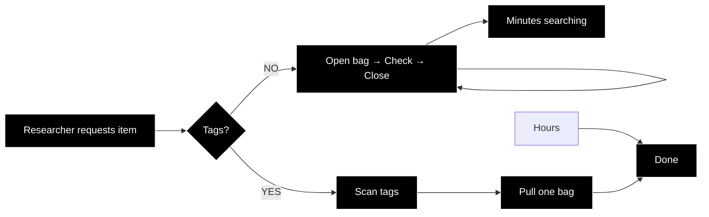

# From Spreadsheet to Garment Tag 👗🏷️

INFO664: Programming for Cultural Heritage  
Pratt Institute, Fall 2025  
Created by Kelsey Kiantoro

## Background: Fashion Archives Need Different Solutions
Fashion archives face unique challenges. Unlike books that display titles on spines, garments hang in protective bags where identification relies entirely on external tags. This project addresses that specific need by automating the creation of physical bag tags that connect digital records to physical objects. Opening each bag to identify contents risks damage to fragile textiles and is incredibly time-consuming. External bag tags allow staff to browse collections visually, just like book spines on a shelf.

*Image credit: Victoria and Albert Museum. From: 5 expert tips on how to store clothes. [vogue.com.au](https://www.vogue.com.au/fashion/news/5-expert-tips-on-how-to-store-clothes/image-gallery/f3009b1b0da6c9bc2ee15f09eb75c0c8?pos=1&page=2)*

With proper bag tags (like those used at the V&A), you can walk down the aisle, scan the tags, and pull the exact item immediately.
But creating these tags manually? Opening Word and typing each field for hundreds of items? That's hours of repetitive work that this tutorial eliminates.

## Label Generator Overview
This workflow creates physical bag tag labels for hanging garments in fashion archives using a PDF-first approach.
The main Python libraries used for this project are:
- [ReportLab Canvas](https://docs.reportlab.com/reportlab/userguide/ch1_intro/#what-is-the-reportlab-pdf-library) - Draws the 2×2 label grid on letter-size pages (8.5" × 11")
- [PIL Image Compression](https://pypi.org/project/pillow/) - Reduces photo file sizes from megabytes to kilobytes while maintaining identification quality
- [BytesIO from io](https://docs.python.org/3/library/io.html) - Handles images in memory without creating temporary files, speeding up processing
- [os.path](https://docs.python.org/3/library/os.html) - checking with the machine to verify image files exist

>### The Combination
>**ReportLab** → Universal PDF output works on any printer. **PIL/Pillow**→ Compresses images from 5MB to 200KB without losing identification ability. **pandas** → Handles CSV files just like Excel. **io.BytesIO** → Processes images in machine memory. **os** → Prevents crashes when images are missing.
> This approach keeps output files under 10MB while processing huge amount of data.

### Working with Different Dataset Sizes
Before running the label generator, think about how many items you have and plan accordingly:
- For <ins>medium collections</ins> (about ~30 items, as in our example): Use the standard 2x2 layout. This will create multiple pages automatically. We recommended having an even number; the sample is within an odd number for example purposes.
- For <ins> large collections</ins> (100 or more items): Process your data in batches of 50 items. Each batch is written to its own output file for printing.
This code automatically figures out how many pages are needed and handles cases where the last page isn’t complete. This means you don’t need to change any code to work with different collection sizes.

## Tutorial
Start here: [Introduction](Tutorial/Introduction.md)

## License
## Creative Commons Attribution-NonCommercial 4.0 International
This work is licensed under a
[Creative Commons Attribution-NonCommercial-ShareAlike 4.0 International License][cc-by-nc-sa].

[![CC BY-NC-SA 4.0][cc-by-nc-sa-image]][cc-by-nc-sa]

[cc-by-nc-sa]: http://creativecommons.org/licenses/by-nc-sa/4.0/
[cc-by-nc-sa-image]: https://licensebuttons.net/l/by-nc-sa/4.0/88x31.png
[cc-by-nc-sa-shield]: https://img.shields.io/badge/License-CC%20BY--NC--SA%204.0-lightgrey.svg
