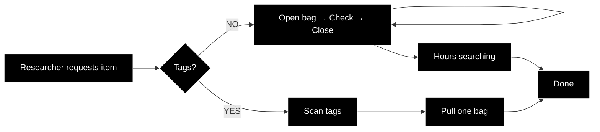

# From Spreadsheet to Label Generator

Python Automation for Fashion Archives

### Introduction
This tutorial teaches archivists to automate garment label creation using Python. We'll transform a CSV spreadsheet into professional bag tags for fashion collections, processing 30 items into a print-ready Word document in seconds rather than hours.
Our implementation builds on the python-docx library (https://python-docx.readthedocs.io/en/latest/), specifically utilizing table creation, text formatting, and document structure features. This approach makes the code accessible to archivists learning Python while maintaining professional output quality.

##### The Problem This Solves

Picture this: You're in a fashion archive storage room with 500 garments in protective bags on racks. A researcher needs "the purple McFadden evening dress from 1989." Without external tags, you'd have to:

With proper bag tags (like those used at the V&A), you can walk down the aisle, scan the tags, and pull the exact item immediately.
But creating these tags manually? Opening Word and typing each field for hundreds of items? That's hours of repetitive work that this tutorial eliminates.

## What You'll Learn
Creating labels manually is time-consuming and error-prone. For a 27-item collection:
- **Manual:** 3-4 hours of copying, formatting, and printing
- **Automated:** 5 minutes with Python

## Prerequisites
- Basic spreadsheet knowledge (Excel/Google Sheets)
- The dataset included the image URLs, which can be hosted in GitHub/CMS.
- Google account (for Colab)

> #### A Note About Images
> **Important:** The photos on these tags are for quick identification, not publication. A phone photo taken in storage is perfectly adequate.

## Dataset Considerations
Before starting, consider your collection size:
- **Small (<4 items):** You'll have empty label spaces
- **Medium (4-100 items):** Perfect for this tutorial
- **Large (>100 items):** Process in batches

Ready? Let's begin with [Chapter 1: Setup](chapter-1-setup.md)
