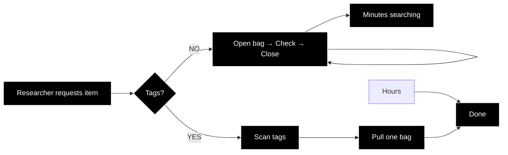

# From Spreadsheet to Garment Tag
Python Automation for Fashion Archives

### Introduction
This tutorial teaches archivists to automate garment label creation using Python. We'll transform a CSV spreadsheet into professional bag tags for fashion collections, processing 30 items into a print-ready PDF document in seconds rather than hours. You need to have a Google Account to run this on Google Colab/if you have Visual Studio Code, the code should run perfectly fine.
Our implementation combines four essential Python libraries:

- [ReportLab](https://www.reportlab.com/docs/reportlab-userguide.pdf): creates PDF documents with exact layout and formatting
- [PIL/Pillow](https://pillow.readthedocs.io/): handles image processing and compression to keep file sizes under 10MB
- [pandas](https://pandas.pydata.org/): processes your CSV
- [os](https://docs.python.org/3/library/os.html): it's like terminal on your machine.
- [io](https://docs.python.org/3/library/io.html): deal with image without creating new files

##### The Problem This Solves
Picture this: You're in a fashion archive storage room with 500 garments in protective bags on racks. A researcher needs "the purple McFadden evening dress from 1989." Without external tags, you'd have to:

With proper bag tags (like those used at the V&A), you can walk down the aisle, scan the tags, and pull the exact item immediately.
But creating these tags manually? Opening Word and typing each field for hundreds of items? That's hours of repetitive work that this tutorial eliminates.

## Sample Data
Use the included files in the '[Resource](/Resource)' Folder:
- `Garment_Bag_Tag_Dataset.csv` file, which contains garment records.
- 27 image files in .jpg format
- the .ipnyb or The Spreadsheet to Garment Tag automation code

> [!IMPORTANT]
**Please review the [Dataset Usage Rights](Dataset/Dataset%20Usage%20%26%20Rights.md) before using any images.**

> #### A Note About Images
> **Important:** The photos on these tags are for quick identification, not publication. A phone photo taken in storage is perfectly adequate.

## Dataset Considerations
Before starting, consider your collection size:
- **Medium (4-100 items):** Perfect for this tutorial
- **Large (>100 items):** Process in batches

Ready? Let's begin by clicking on the Google Colab below;

---

📝 **Note:** Read the [Customization Guide](CUSTOMIZATION.md) for data preparation tips.
